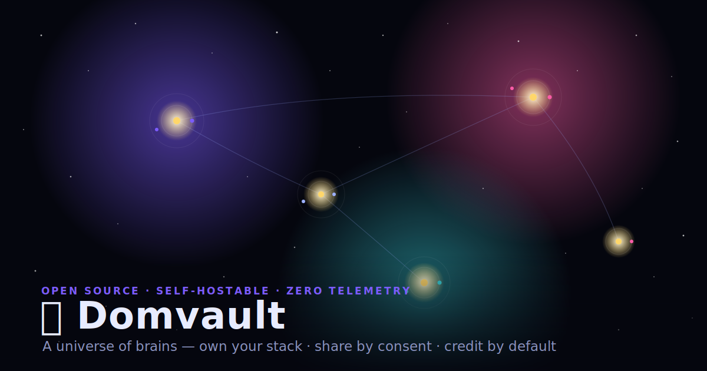

# 🧠 Domvault — an AI-augmented second brain you can self-host

<p align="center">
  
</p>

> Own your notes (plain Markdown, on your machine), let an agent surface the connections between them, and share only what you choose — signed and credited.

**▶ See it live** — explore my own notes as a zoomable universe, no install needed: **https://dys5315.github.io/domvault/constellation/**

**What it is**

- 🗃️ **Self-hosted & plain-text** — a folder of Markdown (works with Obsidian). No cloud, no telemetry, works offline.
- 🧩 **An agent that connects your thinking** — it ingests what you save and proposes links between your own notes on a schedule.
- 🔭 **Opt-in, attributed sharing** — publish individual notes (signed + content-addressed) to a shared graph; your vault stays private by default.

> Domvault is the *engine*, not the *content*. You bring your own notes; the repo ships the structure, workflows, scripts, and agent instructions that make a plain folder of Markdown behave like a living, self-improving graph.

*Source-available (PolyForm Noncommercial) · zero runtime dependencies · honest note: I designed and directed it, but an AI agent wrote most of the code.*

---

## Why this exists

Most "second brain" templates are just empty folders. Domvault adds three things on top:

1. **An agent contract** (`CLAUDE.md`) — so Claude (Code, web, or Cowork) knows your conventions, origin-tracking scheme, and the exact repeatable workflows for ingesting screenshots, chats, and research.
2. **A self-synthesis loop** — a scheduled job that generates cheap "sparks" (half-ideas linking two notes) and promotes the best into full "neuron" synthesis notes. Your graph compounds without you touching it.
3. **Constellation (opt-in)** — you explicitly choose which notes/frameworks to publish. Published nodes form a shared, *credited* knowledge graph that others can browse and pull. This is the consensual substrate for a future marketplace — never a backdoor into anyone's private vault.

---

## The cosmology (how the marketplace scales)

```
🌌  Universe        →  the whole Constellation network (all public knowledge)
 ✨  Galaxy          →  a topic cluster or an org (e.g. "AI Engineering", "Acme Inc")
   ☀️  Solar system  →  one person's brain (their published nodes only)
     🪐  Planet       →  a single published note / framework
       🌙  Moon       →  a version or fork of a note
```

Everything inside a solar system is **owned and gated by its owner**. A planet only appears in the Universe if its owner published it. Pulling someone's planet into your own brain creates a *linked copy* that keeps attribution back to the origin star. That's the whole trust model: nothing moves without consent, and credit travels with the node.

---

## What's in this repo

| Path | What it is |
|------|------------|
| [`template/`](template/) | The empty, scrubbed vault skeleton. Clone-and-go. |
| [`plugin/`](plugin/) | One-command installer that scaffolds a new brain. |
| [`registry/`](registry/) | The opt-in publish/pull **spec** + manifest schema for Constellation. |
| [`constellation/`](constellation/) | Design + mock for the universe visualization (web app). |
| [`frameworks/`](frameworks/) | Genericized mental models that passed the **Publish Rubric** — example shareable content. |
| [`docs/`](docs/) | Philosophy, architecture, getting-started, workflows, IP/licensing, the publish rubric. |
| [`scripts/`](scripts/) | Portable ingestion scripts (ChatGPT export → notes, etc.). |

---

## Quick start

```bash
# see it first — publishes sample notes locally and opens the Constellation Explorer
git clone https://github.com/dys5315/domvault.git && cd domvault
npm install
npm run demo

# then scaffold your own brain (open ~/my-brain in Obsidian, point Claude at it)
./plugin/install.sh ~/my-brain
```

Full walkthrough: [`docs/03-getting-started.md`](docs/03-getting-started.md).

---

## Privacy & consent (read this)

Domvault **never** phones home. The base engine has no network calls. Constellation publishing is:

- **Opt-in per note** — nothing is shared unless you run `publish` on it.
- **Explicit** — you see a diff of exactly what leaves your machine.
- **Attributed** — your name/handle travels with every published node.
- **Revocable** — unpublishing removes the planet from the Universe.

There is no telemetry, no silent sync, no analytics on your private notes. If you ever find code that violates this, it's a bug — open an issue.

---

## License & credit

Source-available under **[PolyForm Noncommercial 1.0.0](LICENSE)**: use it, study it, modify it, share it freely for any non-commercial purpose — but you may **not** sell it or build a commercial product on it without permission, and you must keep the attribution. The author retains all commercial rights. See [`docs/06-ip-and-licensing.md`](docs/06-ip-and-licensing.md) for plain-English details.

> Required Notice: Copyright (c) 2026 Dom Sadarangani (Domvault / Constellation)
